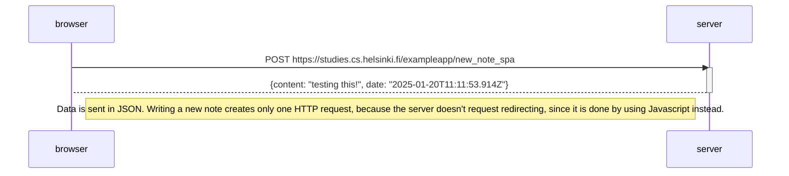

```mermaid
sequenceDiagram
    participant browser
    participant server

    browser->>server: POST https://studies.cs.helsinki.fi/exampleapp/new_note_spa
    activate server
    server-->browser: {content: "testing this!", date: "2025-01-20T11:11:53.914Z"}
    deactivate server
    Note right of browser: Data is sent in JSON. Writing a new note creates only one HTTP request, because the server doesn't request redirecting, since it is done by using Javascript instead.

```